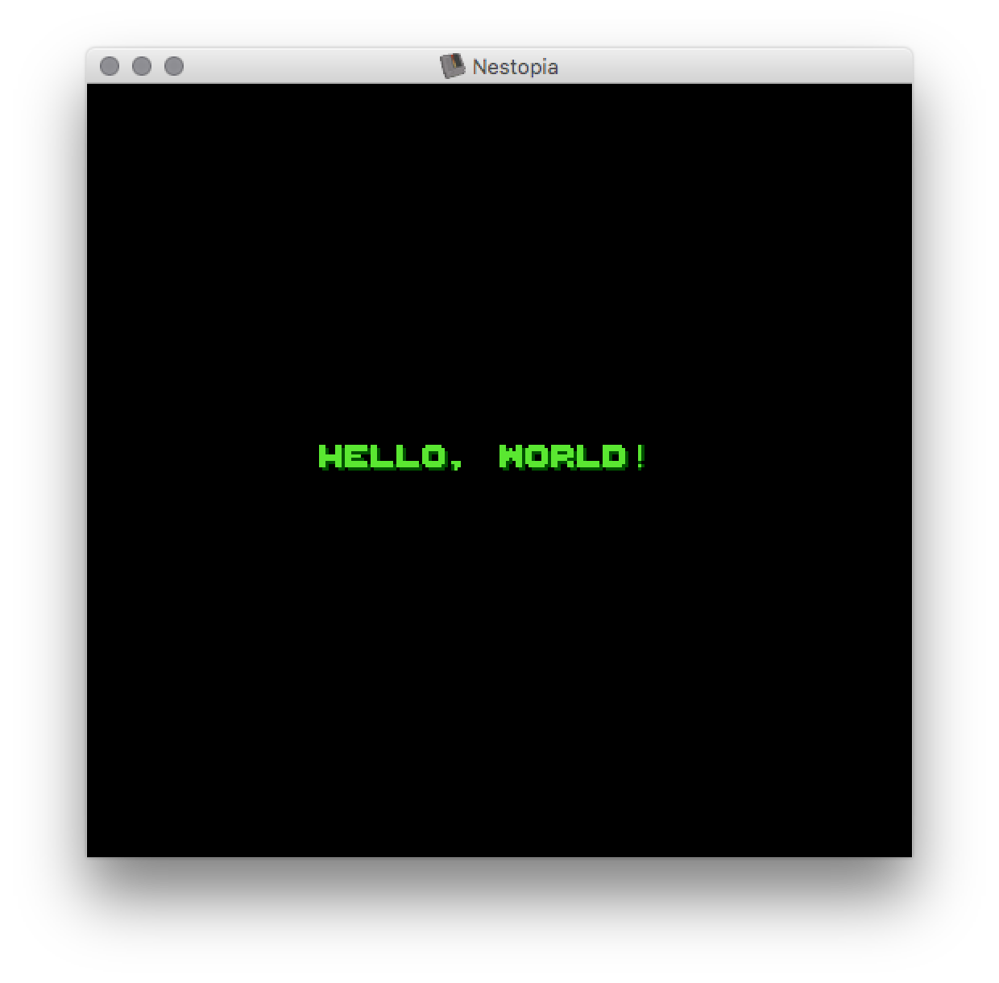

# bmp2chr

Make NES pattern table from 8bit bitmap.

### Description

- converting from bitmap to NES pattern table (CHR) for UNIX
- NOTE: source bitmap format:
  - width, height = 128, 128
  - color = 8bit (256 colors)
- not containing the pallete data.
- source bitmap color will mod by 4
- this command makes 256 patterns (1 pattern = 8x8) from left top of the bitmap.

```
$00 $01 $02 $03 $04 $05 $06 $07 $08 $09 $0a $0b $0c $0d $0e $0f
$10 $11 $12 $13 $14 $15 $16 $17 $18 $19 $1a $1b $1c $1d $1e $1f
$20 $21 $22 $23 $24 $25 $26 $27 $28 $29 $2a $2b $2c $2d $2e $2f
:
$f0 $f1 $f2 $f3 $f4 $f5 $f6 $f7 $f8 $f9 $fa $fb $fc $fd $fe $ff
```

### How to build

```
make
```

### Usage

```
bmp2chr test.bmp test.chr
```

### How to test

__NOTE:__ need install [cc65](https://cc65.github.io/) before testing.

```
make test
open test.nes
```




### License

MIT
